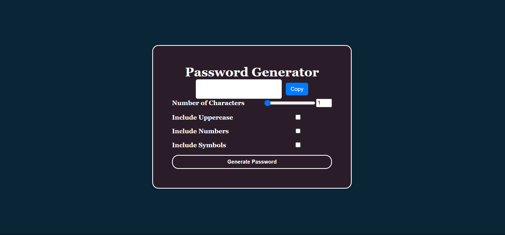

# Password Generator 🔑

A simple **Password Generator** built using  **HTML, CSS, and JavaScript** . This tool allows users to generate strong and secure passwords with customizable options like length, uppercase letters, numbers, and symbols.

---

## 🚀 Features

✅ Generate strong passwords instantly

✅ Customize password length (1-50 characters)

✅ Option to include  **uppercase letters** ,  **numbers** , and **symbols**

✅ Interactive UI with range slider for password length selection

✅ Copy generated password to clipboard with one click

✅ Lightweight and easy to use

---

## 📸 Demo



---

## 🛠️ Technologies Used

* **HTML** – Structure of the page
* **CSS** – Styling & layout
* **JavaScript** – Logic for generating random passwords

---

## 📂 File Structure

```
📁 password-generator
│── 📄 index.html      # Main HTML file
│── 📄 style.css       # Styling for password generator
│── 📄 script.js       # JavaScript logic for password generation
│── 📄 README.md       # Documentation
```

---

## 📜 How It Works

1. Select the **password length** using the range slider or input box.
2. Enable/Disable options for:
   * **Uppercase letters**
   * **Numbers**
   * **Symbols**
3. Click **"Generate Password"** to create a random password.
4. Click the **"Copy"** button to copy the generated password to the clipboard.
5. The generated password will be displayed instantly.

---

## 🚀 Usage

1. Clone the repository:
   ```sh
   git clone 
   ```
2. Navigate to the project folder:
   ```sh
   cd 
   ```
3. Open `index.html` in your browser.

---

## 💡 Future Enhancements

🔹 Implement a password strength indicator.

---

## ⭐ Contributing

Contributions are welcome! Feel free to fork the repository, open issues, or submit pull requests.

---

*If you like this project, give it a ⭐ on GitHub!* 🚀
